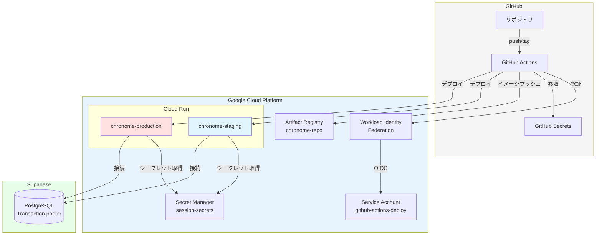
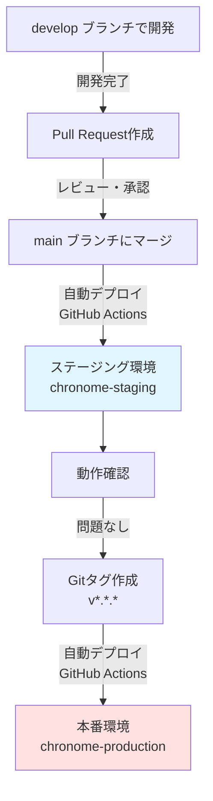
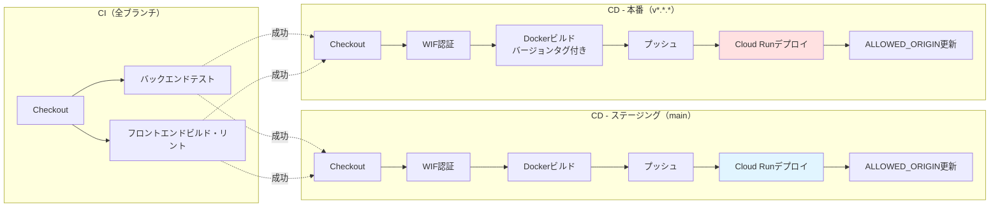

# ADR 0002: GitHub Actions を用いたステージング・本番の自動デプロイ環境を構築する

## ステータス

採用済み

## 日付

2026-07-16

## 背景

ChronoMe はポートフォリオ用途のアプリケーションとして Cloud Run + Supabase PostgreSQL で運用している。開発初期は手動デプロイで十分だったが、開発が進むにつれて以下の課題が顕在化してきた。

- デプロイ手順が属人化しており、再現性に欠ける。
- ステージング環境がなく、本番環境で直接動作確認を行う必要がある。
- デプロイ前のテスト・ビルド・リントの実行が手動であり、品質担保が不安定。
- ロールバック手順が整備されておらず、問題発生時の対応が困難。
- 複数人での開発を想定した場合、ブランチ戦略とデプロイフローが不明確。

また、ポートフォリオとして採用担当者にアピールする際、CI/CD の実装は実務能力を示す重要な要素となる。継続的デリバリーの実装により、開発速度と品質の両立を実現したい。

アプリケーションは既に Cloud Run で稼働しており、GCP プロジェクト（`chronome-488908`）も存在する。Supabase への移行も完了しているため、DB 接続も安定している。この基盤の上に、安全で効率的な CD 環境を構築する必要がある。

## 決定

ChronoMe に GitHub Actions を用いたステージング・本番の自動デプロイ環境を構築する。

採用後の主要構成:

### インフラ構成

- **CI/CD プラットフォーム**: GitHub Actions
- **認証方式**: Workload Identity Federation（キーレス認証）
- **コンテナレジストリ**: Artifact Registry
- **シークレット管理**: Secret Manager + GitHub Secrets
- **デプロイ先**: Cloud Run（`chronome-staging`, `chronome-production`）
- **データベース**: Supabase PostgreSQL（共通）

### ブランチ戦略とデプロイフロー

- **`develop`**: 日常的な開発作業用ブランチ
- **`main`**: 本番準備完了コード（mainへのマージでステージングに自動デプロイ）
- **タグ (`v*.*.*`)**: 本番リリース（タグ作成で本番環境に自動デプロイ）

デプロイフロー:

### 環境分離

- **ステージング環境**:
  - サービス名: `chronome-staging`
  - デプロイトリガー: `main` ブランチへのpush
  - セッションシークレット: `chronome-staging-session-secret`（Secret Manager）
  - イメージタグ: `asia-northeast1-docker.pkg.dev/chronome-488908/chronome-repo/chronome-staging:{sha}`, `latest`

- **本番環境**:
  - サービス名: `chronome-production`
  - デプロイトリガー: Gitタグ（`v*.*.*`）の作成
  - セッションシークレット: `chronome-production-session-secret`（Secret Manager）
  - イメージタグ: `asia-northeast1-docker.pkg.dev/chronome-488908/chronome-repo/chronome-production:{sha}`, `{version}`, `latest`

### セキュリティ構成

- Workload Identity Federation による GitHub Actions からの GCP 認証（サービスアカウントキー不要）
- Secret Manager でセッションシークレットを管理
- GitHub Secrets で Supabase 接続文字列を管理
- 環境ごとに異なるセッションシークレットを使用

### 自動化されるステップ

1. **CI（全ブランチ）**:
   - バックエンドテスト（ユニットテスト・E2Eテスト）
   - フロントエンドビルド・リント

2. **CD - ステージング（mainブランチ）**:
   - Dockerイメージビルド＆プッシュ
   - Cloud Runへのデプロイ
   - ALLOWED_ORIGIN環境変数の自動更新

3. **CD - 本番（v*.*.*タグ）**:
   - Dockerイメージビルド＆プッシュ（バージョンタグ付き）
   - Cloud Runへのデプロイ
   - ALLOWED_ORIGIN環境変数の自動更新

## 検討した選択肢

### Cloud Build を使う

**概要**: GCP ネイティブの CI/CD サービスを使用する。

**メリット**:
- GCP 内で完結するため、Cloud Run や Artifact Registry との統合が容易。
- Cloud Build トリガーで GitHub リポジトリと連携できる。
- ビルドマシンが GCP 内にあるため、GCP サービスへのアクセスが高速。

**デメリット**:
- GitHub Actions に比べてワークフロー定義がやや複雑。
- コミュニティの情報量やエコシステムが GitHub Actions より小さい。
- GitHub Actions の豊富なアクション（marketplace）を利用できない。
- YAML 設定が GitHub Actions と異なるため、学習コストがかかる。

**採用しなかった理由**: ポートフォリオとして GitHub Actions の実装経験を示したい。また、GitHub Actions は業界標準的に使われており、情報量も多い。

### サービスアカウントキーを使う

**概要**: GitHub Secrets にサービスアカウントの JSON キーを保存し、認証に使用する。

**メリット**:
- 設定が簡単（JSON キーをダウンロードして GitHub Secrets に保存するだけ）。
- Workload Identity Federation の設定が不要。

**デメリット**:
- JSON キーが漏洩すると、誰でもそのサービスアカウントとして GCP にアクセスできる。
- キーのローテーションが手動で必要。
- Google のベストプラクティスに反する（Workload Identity Federation が推奨されている）。

**採用しなかった理由**: セキュリティベストプラクティスに従い、Workload Identity Federation を採用する。ポートフォリオとして、最新のセキュリティプラクティスを実装していることを示したい。

### 単一環境（本番のみ）で運用する

**概要**: ステージング環境を作らず、本番環境のみで運用する。

**メリット**:
- インフラコストが削減できる（Cloud Run は1環境のみ）。
- 運用がシンプルになる。
- デプロイフローが単純化される。

**デメリット**:
- 本番環境で直接動作確認を行う必要があり、リスクが高い。
- 問題が発生した場合、即座にユーザーに影響する。
- 複数の変更を並行して検証できない。
- ポートフォリオとして、ステージング環境の運用経験を示せない。

**採用しなかった理由**: ポートフォリオとして、ステージング・本番の環境分離を実装した経験を示したい。また、Cloud Run は無料枠があり、コスト面でも問題ない。

### 手動デプロイを継続する

**概要**: 手動で `gcloud run deploy` コマンドを実行してデプロイする。

**メリット**:
- CI/CD の構築コストがかからない。
- デプロイタイミングを完全にコントロールできる。
- GitHub Actions や Workload Identity Federation の設定が不要。

**デメリット**:
- デプロイ手順が属人化する。
- テスト・ビルド・リントの実行が手動であり、品質担保が不安定。
- デプロイ忘れや手順ミスが発生しやすい。
- ポートフォリオとして、CI/CD の実装経験を示せない。

**採用しなかった理由**: 実務での開発を想定すると、CI/CD は必須のスキル。ポートフォリオとして、自動デプロイの実装経験を示したい。

### trunk-based development（mainのみ）を採用する

**概要**: develop ブランチを作らず、main ブランチに直接コミット・マージする。

**メリット**:
- ブランチ管理がシンプルになる。
- マージの手間が減る。
- 短いサイクルでのデプロイが促進される。

**デメリット**:
- main ブランチが不安定になるリスクがある。
- 複数の機能を並行開発する場合、競合が発生しやすい。
- ポートフォリオとして、ブランチ戦略の理解を示しにくい。

**採用しなかった理由**: ポートフォリオとして、develop → main → タグという明確なブランチ戦略を実装した経験を示したい。小規模プロジェクトでも、ブランチ戦略の理解は重要。

## 採用理由

GitHub Actions + Workload Identity Federation によるステージング・本番の自動デプロイ環境を採用した主な理由は次の通り。

- **業界標準の実装**: GitHub Actions は広く使われており、ポートフォリオとして実務で使えるスキルを示せる。
- **セキュリティベストプラクティス**: Workload Identity Federation により、サービスアカウントキーを使わない安全な認証を実装できる。
- **環境分離**: ステージング・本番の2環境を分離することで、安全に動作確認できる。
- **明確なブランチ戦略**: develop → main → タグという明確なフローにより、チーム開発を想定した運用ができる。
- **自動化による品質担保**: テスト・ビルド・デプロイを自動化することで、人的ミスを減らし、品質を安定させる。
- **コスト効率**: Cloud Run は無料枠があり、ステージング環境のコストも最小限に抑えられる。
- **ポートフォリオとしての価値**: CI/CD の実装は、採用担当者に実務能力をアピールする重要な要素。

## 結果

### 良い影響

- **デプロイの再現性**: ワークフロー定義により、誰でも同じ手順でデプロイできる。
- **品質の安定化**: 自動テスト・リントにより、品質を担保できる。
- **安全なデプロイ**: ステージング環境で動作確認してから本番デプロイできる。
- **ロールバック可能**: Cloud Run のリビジョン管理により、簡単にロールバックできる。
- **セキュリティ向上**: Workload Identity Federation により、サービスアカウントキーの管理が不要。
- **開発速度の向上**: 自動デプロイにより、手動作業が減り、開発に集中できる。
- **ポートフォリオとしての価値**: CI/CD の実装経験を採用担当者に示せる。
- **環境分離**: ステージング・本番で異なるセッションシークレットを使用し、データを分離できる。
- **バージョン管理**: Gitタグとイメージタグにより、どのバージョンがデプロイされているか明確。

### 悪い影響・トレードオフ

- **初期構築コスト**: GitHub Actions ワークフロー、Workload Identity Federation、Secret Manager の設定に時間がかかる。
- **運用コスト**: ステージング環境の Cloud Run インスタンスが追加で必要（ただし無料枠内で運用可能）。
- **複雑性の増加**: 単一環境・手動デプロイに比べて、システム全体の複雑性が増す。
- **トラブルシューティング**: GitHub Actions、GCP、Supabase の3つのサービスを横断して調査する必要がある。
- **学習コスト**: GitHub Actions のワークフロー定義や Workload Identity Federation の理解が必要。
- **デプロイ待ち時間**: CI/CD パイプラインの実行時間（ビルド・テスト・デプロイ）が数分かかる。

### 環境のコスト試算

| 環境 | Cloud Run | Artifact Registry | Secret Manager | 合計 |
|------|-----------|-------------------|----------------|------|
| ステージング | $0-2/月 | $0.10-0.15/月 | $0（無料枠） | $0-2/月 |
| 本番 | $2-10/月 | $0.10-0.15/月 | $0（無料枠） | $2-10/月 |
| **合計** | | | | **$2-13/月** |

## 運用上の注意

### GitHub Secrets の管理

以下の6つの Secrets を適切に管理する必要がある:

- `GCP_PROJECT_ID`
- `GCP_WORKLOAD_IDENTITY_PROVIDER`
- `GCP_SERVICE_ACCOUNT`
- `SUPABASE_DB_DSN`
- `STAGING_SESSION_SECRET`
- `PRODUCTION_SESSION_SECRET`

特に `SUPABASE_DB_DSN` にはパスワードが含まれるため、取り扱いに注意する。

### ブランチ保護ルールの設定

main ブランチには保護ルールを設定し、Pull Request 経由でのマージを推奨する:

- PR 作成を必須にする
- CI ジョブの成功を必須にする
- レビュー承認を推奨する（個人開発では任意）

### デプロイ監視

GitHub Actions の通知を有効にし、デプロイの成功・失敗を確認できるようにする。また、Cloud Run のログやメトリクスを定期的に確認する。

### セッションシークレットのローテーション

Secret Manager のセッションシークレットは定期的にローテーションすることを推奨する。ローテーション時は以下の手順で行う:

1. 新しいシークレットを Secret Manager に追加
2. Cloud Run サービスを更新して新しいシークレットを参照
3. 古いシークレットを無効化

### バージョン管理

本番デプロイは必ずセマンティックバージョニング（`v{MAJOR}.{MINOR}.{PATCH}`）に従ったタグで行う。タグの履歴がデプロイ履歴となるため、適切に管理する。

### Supabase データベースの共有

ステージング・本番環境で同じ Supabase データベースを使用している場合、データの分離に注意する。将来的には、ステージング用の別データベースを用意することを検討する。

## 再検討条件

次の条件を満たす場合は、この決定を再検討する。

- **GitHub Actions のコストが問題になる**: 実行時間が長くなり、GitHub Actions の課金が発生する場合。
- **Cloud Build への移行が必要**: GCP 内で CI/CD を完結させる要件が発生した場合。
- **環境を増やす必要がある**: 開発環境、QA環境など、3つ以上の環境が必要になった場合。
- **複数リージョンへのデプロイが必要**: グローバル展開で複数リージョンへのデプロイが必要になった場合。
- **Workload Identity Federation が使えない**: 何らかの理由で Workload Identity Federation が使用できなくなった場合。
- **Supabase データベースの分離が必要**: ステージング・本番で完全にデータを分離する必要が生じた場合。
- **セキュリティ要件の変更**: より厳格なセキュリティ要件（例: プライベート VPC、カスタムドメイン、Cloud Armor）が必要になった場合。
