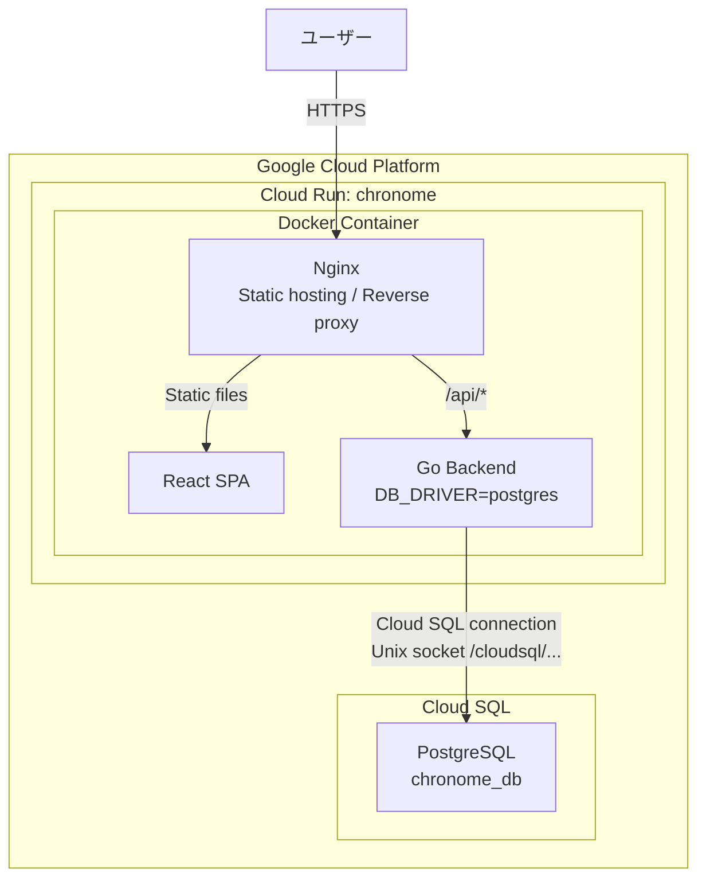
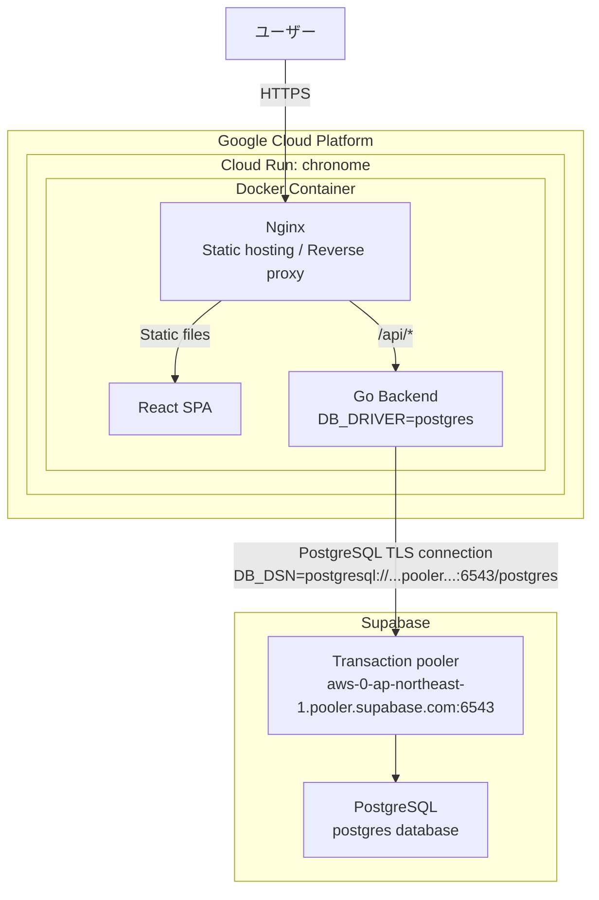

# Cloud Run / Cloud SQL から Supabase への構成変更まとめ

## 概要

ChronoMe は Cloud Run 上の 1 コンテナ構成を維持したまま、データベース接続先を GCP Cloud SQL for PostgreSQL から Supabase PostgreSQL に変更した。

- 変更前: Cloud Run + Cloud SQL PostgreSQL
- 変更後: Cloud Run + Supabase PostgreSQL
- Cloud Run サービス名: `chronome`
- GCP Project ID: `chronome-488908`
- Region: `asia-northeast1`
- DB接続方式: Supabase Transaction pooler

アプリケーションコード側は `DB_DRIVER=postgres` と `DB_DSN` で接続先を切り替える設計のため、今回の主な変更点はインフラ設定と接続文字列である。

---

## 変更前アーキテクチャ



### 変更前の特徴

- Cloud Run と Cloud SQL がどちらも GCP 内にある。
- Cloud Run は Cloud SQL 接続を有効化して、Unix socket 経由で PostgreSQL に接続する。
- `DB_DSN` は `host=/cloudsql/... user=chronome_user password=... dbname=chronome_db sslmode=disable` の形式。
- Cloud SQL インスタンスの維持費が継続的に発生する。

---

## 変更後アーキテクチャ



### 変更後の特徴

- Cloud Run は引き続き GCP で稼働する。
- PostgreSQL は Supabase 側に移動した。
- Cloud Run の Cloud SQL 接続設定は削除した。
- `DB_DSN` は Supabase の Transaction pooler 接続文字列に変更した。
- パスワードに記号が含まれる場合は URL エンコードが必要。

---

## 今回実施した主な変更

1. Cloud SQL から PostgreSQL dump を取得した。
2. `chronome-backup.sql` をローカルに保存した。
3. Supabase PostgreSQL に dump をインポートした。
4. GitHub Secrets に `SUPABASE_DATABASE_URL` を追加した。
5. Cloud Run の実サービス名が `chronome` であることを確認した。
6. Cloud Run サービス `chronome` の環境変数を Supabase 向けに更新した。
7. Cloud Run の Cloud SQL 接続設定を `--clear-cloudsql-instances` で削除した。

Cloud Run に設定した主要な環境変数:

```text
DB_DRIVER=postgres
DB_DSN=postgresql://postgres.<project-ref>:<encoded-password>@aws-0-ap-northeast-1.pooler.supabase.com:6543/postgres
```

---

## メリット

### コスト削減

Cloud SQL インスタンスの常時稼働コストを削減できる。ポートフォリオ用途や小規模運用では、Supabase Free プランを使える可能性がある。

### Cloud Run 構成を維持できる

アプリケーションのホスティング構成は Cloud Run のまま維持できる。フロントエンド、バックエンド、Nginx のコンテナ構成を大きく変えずにDBだけ移行できる。

### PostgreSQL 互換で移行しやすい

Cloud SQL も Supabase も PostgreSQL のため、アプリケーションコードの変更を最小限にできる。ChronoMe では `DB_DSN` の差し替えで接続先を変更できる。

### 将来の Supabase Auth 移行につなげやすい

現在は独自認証を継続しているが、将来的に Supabase Auth やSSOへ移行する場合、DBがSupabase側にあることで統合しやすくなる。

### Connection pooler を使える

Cloud Run のようなサーバーレス環境では接続数が増減しやすい。Supabase Transaction pooler を使うことで、PostgreSQLへの直接接続数を抑えやすい。

---

## デメリット

### GCP 内部接続ではなくなる

Cloud Run から Supabase への外部ネットワーク接続になる。Cloud Run + Cloud SQL のようなGCP内の密結合構成ではなくなる。

### レイテンシやネットワーク依存が増える

Cloud Run は GCP、DB は Supabase 側のインフラになるため、ネットワーク経路が長くなる可能性がある。小規模用途では問題になりにくいが、高頻度アクセスでは計測が必要。

### Free プランの制約を受ける

Supabase Free プランには容量、接続、停止、バックアップ、サポートなどの制約がある。商用本番や高可用性が必要な用途では有料プランや別構成を検討する必要がある。

### 接続文字列の管理が重要になる

Supabase の接続文字列にはパスワードが含まれる。GitHub Secrets や Cloud Run 環境変数で安全に扱う必要がある。また、URL形式ではパスワードのURLエンコードが必要。

### 障害調査の対象が増える

変更前は主にGCP内で調査できたが、変更後は GCP Cloud Run と Supabase の両方を見る必要がある。障害時には Cloud Run ログ、Supabase DB状態、接続数、pooler状態を切り分ける必要がある。

---

## トレードオフ

| 観点 | Cloud SQL | Supabase |
| --- | --- | --- |
| 月額コスト | 常時費用が発生しやすい | Freeプランなら低コスト |
| GCP統合 | Cloud Runと統合しやすい | 外部DBとして接続 |
| 運用の見通し | GCP内で完結 | GCP + Supabase の2サービスを見る |
| PostgreSQL互換性 | 高い | 高い |
| サーバーレス接続 | Cloud SQL connector / Unix socket | Transaction pooler |
| 将来の認証統合 | 別途構築が必要 | Supabase Authに移行しやすい |
| 本番信頼性 | GCPのマネージドDBとして扱いやすい | プラン制約とSLA確認が必要 |
| ポートフォリオ用途 | ややコスト過多 | 低コストで説明しやすい |

今回の判断では、ChronoMe がポートフォリオ用途であり、DB負荷も小さいため、コスト削減と将来の Supabase Auth 移行余地を優先して Supabase へ移行した。

---

## 移行後の確認項目

### Cloud Run 設定

```bash
gcloud run services describe chronome \
  --region=asia-northeast1 \
  --project=chronome-488908 \
  --format="yaml(spec.template.metadata.annotations,spec.template.spec.containers[0].env)"
```

確認ポイント:

- `DB_DRIVER` が `postgres`
- `DB_DSN` が Supabase の `pooler.supabase.com:6543` を向いている
- `run.googleapis.com/cloudsql-instances` がない、または空
- `DB_DSN` に `/cloudsql/` や `chronome_user` が残っていない

### Supabase データ件数

```sql
select 'users' as table_name, count(*) from public.users
union all select 'projects', count(*) from public.projects
union all select 'entries', count(*) from public.entries
union all select 'tags', count(*) from public.tags
union all select 'entry_tags', count(*) from public.entry_tags
union all select 'allocation_requests', count(*) from public.allocation_requests
union all select 'task_allocations', count(*) from public.task_allocations;
```

移行時の dump に含まれていた件数:

| テーブル | 件数 |
| --- | ---: |
| `users` | 1 |
| `projects` | 3 |
| `entries` | 3 |
| `tags` | 0 |
| `entry_tags` | 0 |
| `allocation_requests` | 0 |
| `task_allocations` | 0 |

### アプリ動作

- ログインできること
- プロジェクト一覧が表示されること
- 時間記録の一覧が表示されること
- 新規作成、更新、削除がDBに反映されること
- Cloud Run ログにDB接続エラーが出ていないこと

---

## Cloud SQL 停止前の注意

移行直後に Cloud SQL を削除しない。まず数日間 Supabase 構成で問題がないことを確認し、その後 Cloud SQL を停止する。

推奨順序:

1. Supabase 上でデータ件数を確認する。
2. Cloud Run 経由でアプリの主要操作を確認する。
3. Cloud Run ログにDB接続エラーがないことを確認する。
4. 数日間問題がなければ Cloud SQL を停止する。
5. バックアップ保持期間を決めてから Cloud SQL の削除を検討する。
