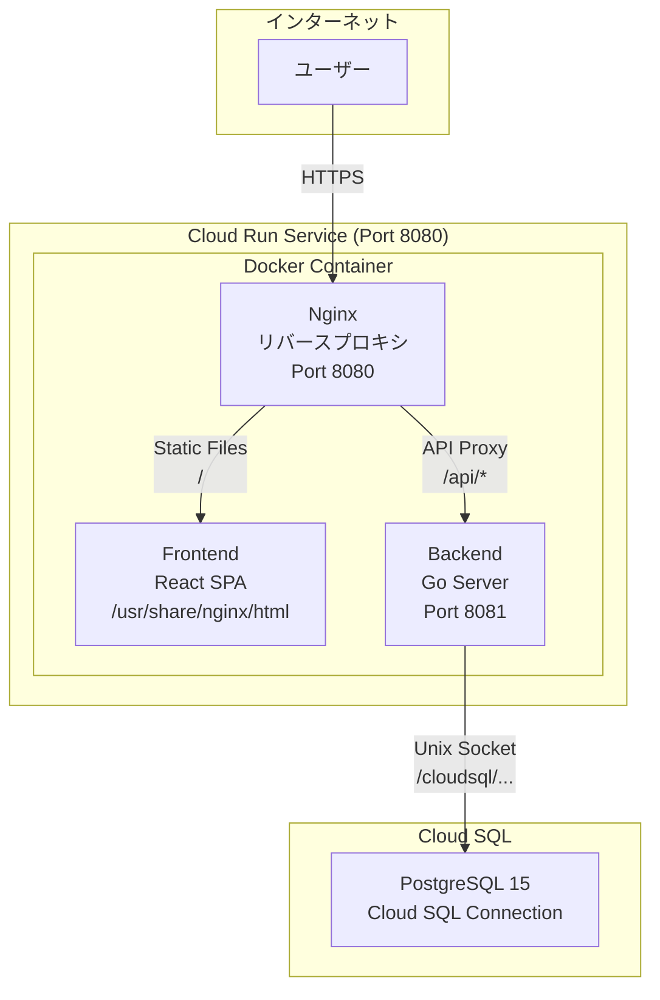

# ChronoMe GCP Cloud Run デプロイ計画

このドキュメントは、ChronoMeアプリケーションをGoogle Cloud Platform (GCP) の Cloud Run にデプロイするための完全な計画と手順を記載しています。

## 目次

1. [アーキテクチャ概要](#アーキテクチャ概要)
2. [前提条件](#前提条件)
3. [必要なGCPサービス](#必要なgcpサービス)
4. [環境変数一覧](#環境変数一覧)
5. [デプロイ手順](#デプロイ手順)
6. [コスト見積もり](#コスト見積もり)
7. [トラブルシューティング](#トラブルシューティング)

---

## アーキテクチャ概要



**デプロイ戦略:**
- マルチステージDockerビルドで、フロントエンドとバックエンドを1つのコンテナに統合
- Nginxをリバースプロキシとして使用し、`/api/*` リクエストをGoバックエンドに転送
- 静的ファイル（React）はNginxから直接配信
- Cloud SQLはCloud RunのCloud SQL接続（Unix socket）で接続

---

## 前提条件

### ローカル環境
- [x] Google Cloud SDK (gcloud CLI) インストール済み
- [x] Docker インストール済み
- [x] GitHub リポジトリへのpushアクセス
- [x] GCPアカウント（無料枠または課金有効化済み）

### GCPプロジェクト
- [ ] GCPプロジェクト作成済み
- [ ] 課金アカウント紐付け済み
- [ ] 必要なAPIの有効化（後述）

---

## 必要なGCPサービス

### 1. Cloud Run
**用途:** アプリケーションのホスティング
**料金:** 無料枠あり（月200万リクエスト、18万vCPU秒、36万GiB秒）
**リージョン:** `asia-northeast1` (東京) 推奨

### 2. Cloud SQL (PostgreSQL)
**用途:** データベース
**推奨インスタンス:**
- **標準:** `db-g1-small` (共有vCPU, 1.7GB RAM) - 約$15-20/月
- **最小構成:** `db-f1-micro` (共有vCPU, 0.6GB RAM) - 約$7-10/月

**ストレージ:** 20GB SSD

### 3. Artifact Registry
**用途:** Dockerイメージの保存
**料金:** 0.5GB無料枠、以降$0.10/GB/月

### 4. Cloud Build（オプション）
**用途:** CI/CD（GitHub Actionsでも代替可能）
**料金:** 120分/日の無料枠

### 5. Secret Manager
**用途:** 機密情報の管理（SESSION_SECRET等）
**料金:** 6シークレットまで無料、以降$0.06/シークレット/月

---

## 環境変数一覧

以下の環境変数をCloud Runサービスに設定する必要があります。

### バックエンド（Go）環境変数

| 変数名 | 必須 | 説明 | 本番環境の例 |
|--------|------|------|-------------|
| `APP_ENV` | ✅ | 実行環境 | `production` |
| `SERVER_ADDRESS` | ✅ | Goサーバーのリッスンアドレス（NginxはCloud Run公開用に`:8080`を使用） | `:8081` |
| `DB_DRIVER` | ✅ | データベースドライバ | `postgres` |
| `DB_DSN` | ✅ | データベース接続文字列 | `host=/cloudsql/PROJECT_ID:REGION:INSTANCE_NAME user=chronome_user password=PASSWORD dbname=chronome_db sslmode=disable` |
| `SESSION_SECRET` | ✅ | セッション署名用シークレット（32文字以上） | Secret Managerから取得 |
| `SESSION_COOKIE_SECURE` | ✅ | HTTPSのみCookie送信 | `true` |
| `SESSION_TTL` | ❌ | セッション有効期限 | `12h` (デフォルト) |
| `ALLOWED_ORIGIN` | ✅ | CORS許可オリジン | `https://chronome-HASH-an.a.run.app` |
| `DEFAULT_PROJECT_COLOR` | ❌ | デフォルトプロジェクト色 | `#3B82F6` (デフォルト) |

### フロントエンド（React）環境変数

フロントエンドはビルド時に環境変数を埋め込みます（必要に応じて）。

| 変数名 | 必須 | 説明 | 値 |
|--------|------|------|-----|
| `VITE_API_BASE_URL` | ❌ | APIベースURL | 未設定または空文字（同一オリジン） |

**注:** 現在のフロントエンド設定では、`/api` プロキシを使用しているため、同一ドメイン上で動作します。

---

## デプロイ手順

### Phase 1: GCP初期セットアップ（初回のみ）

#### 1.1 GCP CLIの認証とプロジェクト設定

```bash
# Google Cloudにログイン
gcloud auth login

# プロジェクトIDを設定（既存の場合）
export PROJECT_ID="your-gcp-project-id"
gcloud config set project $PROJECT_ID

# または、新規プロジェクト作成
gcloud projects create $PROJECT_ID --name="ChronoMe"
gcloud config set project $PROJECT_ID

# 課金アカウントを紐付け（課金アカウントIDを確認）
gcloud beta billing accounts list
gcloud beta billing projects link $PROJECT_ID --billing-account=BILLING_ACCOUNT_ID
```

#### 1.2 必要なAPIの有効化

```bash
# Cloud Run API
gcloud services enable run.googleapis.com

# Cloud SQL Admin API
gcloud services enable sqladmin.googleapis.com

# Artifact Registry API
gcloud services enable artifactregistry.googleapis.com

# Cloud Build API（GitHub Actions使わない場合）
gcloud services enable cloudbuild.googleapis.com

# Secret Manager API
gcloud services enable secretmanager.googleapis.com

# Compute Engine API（Private IPを使う場合のみ）
gcloud services enable compute.googleapis.com

# サービスネットワーキングAPI（Cloud SQL Private IPを使う場合のみ）
gcloud services enable servicenetworking.googleapis.com
```

#### 1.3 Artifact Registryリポジトリ作成

```bash
# Docker リポジトリ作成（asia-northeast1: 東京）
gcloud artifacts repositories create chronome-repo \
  --repository-format=docker \
  --location=asia-northeast1 \
  --description="ChronoMe application container images"

# Docker認証設定
gcloud auth configure-docker asia-northeast1-docker.pkg.dev
```

---

### Phase 2: Cloud SQLセットアップ

#### 2.0 Private IP用のVPC Peering作成（Private IPを使う場合のみ）

標準構成では、Cloud Runの `--set-cloudsql-instances` と Unix socket 接続を使用するため、この手順は不要です。

Cloud SQLをPrivate IPで作成するために `--network=default` を指定する場合のみ、事前にPrivate Services Accessを設定してください。未設定のまま作成すると `NETWORK_NOT_PEERED` エラーになります。

```bash
# Service Networking APIが未有効の場合
gcloud services enable servicenetworking.googleapis.com

# default VPC向けの予約IPレンジを作成
gcloud compute addresses create google-managed-services-default \
  --global \
  --purpose=VPC_PEERING \
  --prefix-length=16 \
  --network=projects/${PROJECT_ID}/global/networks/default

# VPCとGoogle managed servicesをピアリング
gcloud services vpc-peerings connect \
  --service=servicenetworking.googleapis.com \
  --ranges=google-managed-services-default \
  --network=default \
  --project=${PROJECT_ID}
```

既に予約レンジやピアリングが存在する場合、この手順は不要です。

#### 2.1 PostgreSQLインスタンス作成

```bash
# Cloud SQL インスタンス作成
gcloud sql instances create chronome-db \
  --database-version=POSTGRES_15 \
  --tier=db-g1-small \
  --region=asia-northeast1 \
  --storage-type=SSD \
  --storage-size=20GB \
  --storage-auto-increase \
  --backup-start-time=03:00 \
  --enable-point-in-time-recovery \
  --retained-backups-count=7 \
  --retained-transaction-log-days=7

# 作成完了まで数分かかります
```

#### 2.2 データベースとユーザー作成

```bash
# PostgreSQLユーザー作成
gcloud sql users create chronome_user \
  --instance=chronome-db \
  --password=SECURE_PASSWORD_HERE

# データベース作成
gcloud sql databases create chronome_db \
  --instance=chronome-db
```

**🔒 セキュリティ注意:**
- `SECURE_PASSWORD_HERE` は強力なパスワードに置き換えてください
- パスワード生成例: `openssl rand -base64 32`

#### 2.3 接続文字列の確認

```bash
# Cloud SQLインスタンスの接続名を取得
gcloud sql instances describe chronome-db --format="value(connectionName)"
# 出力例: your-project-id:asia-northeast1:chronome-db
```

**接続文字列（DSN）の形式:**
```
host=/cloudsql/PROJECT_ID:asia-northeast1:chronome-db user=chronome_user password=PASSWORD dbname=chronome_db sslmode=disable
```

---

### Phase 3: Secret Managerでシークレット管理

#### 3.1 SESSION_SECRETの生成と保存

```bash
# ランダムな64文字のシークレット生成
SESSION_SECRET=$(openssl rand -base64 48)

# Secret Managerに保存
echo -n "$SESSION_SECRET" | gcloud secrets create chronome-session-secret \
  --data-file=- \
  --replication-policy="automatic"

# Cloud Runサービスアカウントにアクセス権限付与
PROJECT_NUMBER=$(gcloud projects describe "$PROJECT_ID" --format="value(projectNumber)")
gcloud secrets add-iam-policy-binding chronome-session-secret \
  --member="serviceAccount:${PROJECT_NUMBER}-compute@developer.gserviceaccount.com" \
  --role="roles/secretmanager.secretAccessor"
```

#### 3.2 データベースパスワードの保存（オプション）

```bash
# データベースパスワードをSecret Managerに保存
echo -n "SECURE_PASSWORD_HERE" | gcloud secrets create chronome-db-password \
  --data-file=- \
  --replication-policy="automatic"
```

---

### Phase 4: Dockerfileとビルド設定

#### 4.1 プロジェクトルートにDockerfile作成

**ファイル:** `/Users/miyu/Workspace/ChronoMe/Dockerfile`

```dockerfile
# マルチステージビルド: フロントエンドビルド
FROM node:20-alpine AS frontend-builder

WORKDIR /app/frontend

# 依存関係をコピーしてインストール
COPY frontend/package*.json ./
RUN npm ci

# ソースコードをコピーしてビルド
COPY frontend/ ./
RUN npm run build

# マルチステージビルド: バックエンドビルド
FROM golang:1.25-alpine AS backend-builder

WORKDIR /app/backend

# sqliteドライバがCGOを使うため、ビルド用のC toolchainを入れる
RUN apk add --no-cache gcc musl-dev

# 依存関係をコピー
COPY backend/go.mod backend/go.sum ./
RUN go mod download

# ソースコードをコピーしてビルド
COPY backend/ ./
RUN CGO_ENABLED=1 GOOS=linux go build -o /chronome-server ./cmd/server

# 最終イメージ: Nginx + バックエンド
FROM nginx:alpine

# Nginxの設定ファイルをコピー
COPY nginx.conf /etc/nginx/nginx.conf

# フロントエンドのビルド成果物をNginxの公開ディレクトリにコピー
COPY --from=frontend-builder /app/frontend/build /usr/share/nginx/html

# バックエンドのバイナリをコピー
COPY --from=backend-builder /chronome-server /usr/local/bin/chronome-server

# 起動スクリプトをコピー
COPY start.sh /start.sh
RUN chmod +x /start.sh

# Cloud Runはポート8080を期待
EXPOSE 8080

# Nginxとバックエンドを起動
CMD ["/start.sh"]
```

#### 4.2 Nginx設定ファイル作成

**ファイル:** `/Users/miyu/Workspace/ChronoMe/nginx.conf`

```nginx
events {
    worker_connections 1024;
}

http {
    include /etc/nginx/mime.types;
    default_type application/octet-stream;

    # ログ設定
    access_log /var/log/nginx/access.log;
    error_log /var/log/nginx/error.log;

    # パフォーマンス設定
    sendfile on;
    keepalive_timeout 65;
    gzip on;
    gzip_types text/plain text/css application/json application/javascript text/xml application/xml application/xml+rss text/javascript;

    server {
        listen 8080;
        server_name _;

        # フロントエンド（React SPA）
        location / {
            root /usr/share/nginx/html;
            try_files $uri $uri/ /index.html;
        }

        # バックエンドAPIプロキシ
        location /api/ {
            proxy_pass http://127.0.0.1:8081/api/;
            proxy_http_version 1.1;
            proxy_set_header Host $host;
            proxy_set_header X-Real-IP $remote_addr;
            proxy_set_header X-Forwarded-For $proxy_add_x_forwarded_for;
            proxy_set_header X-Forwarded-Proto $scheme;
        }

        # ヘルスチェックエンドポイント
        location /health {
            access_log off;
            add_header Content-Type text/plain;
            return 200 "OK\n";
        }

        # バックエンドのヘルスチェックエンドポイント
        location /healthz {
            proxy_pass http://127.0.0.1:8081/healthz;
            proxy_http_version 1.1;
            proxy_set_header Host $host;
            proxy_set_header X-Real-IP $remote_addr;
            proxy_set_header X-Forwarded-For $proxy_add_x_forwarded_for;
            proxy_set_header X-Forwarded-Proto $scheme;
        }
    }
}
```

#### 4.3 起動スクリプト作成

**ファイル:** `/Users/miyu/Workspace/ChronoMe/start.sh`

```bash
#!/bin/sh
set -eu

export SERVER_ADDRESS="${SERVER_ADDRESS:-:8081}"

/usr/local/bin/chronome-server &
BACKEND_PID="$!"

term() {
    kill -TERM "$BACKEND_PID" 2>/dev/null || true
    nginx -s quit 2>/dev/null || true
    wait "$BACKEND_PID" 2>/dev/null || true
}

trap term INT TERM

nginx -g "daemon off;" &
NGINX_PID="$!"

set +e
wait -n "$BACKEND_PID" "$NGINX_PID"
STATUS="$?"
set -e
term
exit "$STATUS"
```

#### 4.4 .dockerignoreファイル作成

**ファイル:** `/Users/miyu/Workspace/ChronoMe/.dockerignore`

```
# Git
.git
.gitignore

Dockerfile

# Frontend
frontend/node_modules
frontend/build
frontend/.vite

# Backend
backend/.gocache
backend/dev.db
backend/*.log

# Documentation
docs/
README.md
*.md

# IDE
.vscode
.idea

# iOS
ios/

# Misc
.DS_Store
```

---

### Phase 5: ローカルでDockerビルドテスト

```bash
# プロジェクトルートに移動
cd /Users/miyu/Workspace/ChronoMe

# Dockerイメージをビルド
docker build -t chronome:local .

# ローカルでテスト実行（環境変数を設定）
docker run -p 8080:8080 \
  -e APP_ENV=development \
  -e DB_DRIVER=sqlite \
  -e DB_DSN=dev.db \
  -e SESSION_SECRET=local-dev-secret-key-for-testing-only \
  -e ALLOWED_ORIGIN=http://localhost:8080 \
  chronome:local

# ブラウザで http://localhost:8080 にアクセスして動作確認
```

---

### Phase 6: Cloud Runへデプロイ（手動）

#### 6.1 Dockerイメージをビルド＆プッシュ

```bash
# プロジェクトIDを設定
export PROJECT_ID="your-gcp-project-id"

# イメージタグを設定
export IMAGE_TAG="asia-northeast1-docker.pkg.dev/${PROJECT_ID}/chronome-repo/chronome:latest"

# Cloud Run向けにlinux/amd64イメージをビルドしてArtifact Registryにプッシュ
docker buildx build --platform linux/amd64 -t "$IMAGE_TAG" --push .
```

#### 6.2 Cloud Runサービスをデプロイ

```bash
# Cloud SQL接続名を取得
export INSTANCE_CONNECTION_NAME=$(gcloud sql instances describe chronome-db --format="value(connectionName)")

# SESSION_SECRETをSecret Managerから取得して環境変数に設定
export SESSION_SECRET=$(gcloud secrets versions access latest --secret="chronome-session-secret")

# Cloud Runにデプロイ
gcloud run deploy chronome \
  --image="$IMAGE_TAG" \
  --platform=managed \
  --region=asia-northeast1 \
  --allow-unauthenticated \
  --set-env-vars="APP_ENV=production,SERVER_ADDRESS=:8081,DB_DRIVER=postgres,ALLOWED_ORIGIN=https://chronome-HASH-an.a.run.app,SESSION_COOKIE_SECURE=true" \
  --set-secrets="SESSION_SECRET=chronome-session-secret:latest" \
  --set-cloudsql-instances="$INSTANCE_CONNECTION_NAME" \
  --memory=512Mi \
  --cpu=1 \
  --min-instances=0 \
  --max-instances=10 \
  --timeout=300

# デプロイ完了後、サービスURLが表示されます
# 例: https://chronome-abc123-an.a.run.app
```

#### 6.3 DB_DSNの設定

デプロイ後、実際のCloud Run URLが確定したら、`DB_DSN`と`ALLOWED_ORIGIN`を更新します。

```bash
# サービスURLを取得
export SERVICE_URL=$(gcloud run services describe chronome --region=asia-northeast1 --format="value(status.url)")

# DB_DSNを設定（パスワードを正しいものに置き換え）
export DB_DSN="host=/cloudsql/${INSTANCE_CONNECTION_NAME} user=chronome_user password=SECURE_PASSWORD_HERE dbname=chronome_db sslmode=disable"

# 環境変数を更新
gcloud run services update chronome \
  --region=asia-northeast1 \
  --set-env-vars="DB_DSN=${DB_DSN},ALLOWED_ORIGIN=${SERVICE_URL}"
```

**🔒 セキュリティ注意:** パスワードを含む環境変数は、Secret Managerを使用することを強く推奨します。

---

### Phase 7: GitHub Actionsで自動デプロイ（推奨）

#### 7.1 Workload Identity Federation設定

```bash
# Workload Identity Poolを作成
gcloud iam workload-identity-pools create github-pool \
  --location="global" \
  --display-name="GitHub Actions Pool"

# Workload Identity Providerを作成（GitHubリポジトリを指定）
gcloud iam workload-identity-pools providers create-oidc github-provider \
  --workload-identity-pool="github-pool" \
  --location="global" \
  --issuer-uri="https://token.actions.githubusercontent.com" \
  --attribute-mapping="google.subject=assertion.sub,attribute.actor=assertion.actor,attribute.repository=assertion.repository" \
  --attribute-condition="assertion.repository_owner=='YOUR_GITHUB_USERNAME'"

# サービスアカウント作成
gcloud iam service-accounts create github-actions-sa \
  --display-name="GitHub Actions Service Account"

# 必要な権限を付与
gcloud projects add-iam-policy-binding $PROJECT_ID \
  --member="serviceAccount:github-actions-sa@${PROJECT_ID}.iam.gserviceaccount.com" \
  --role="roles/run.admin"

gcloud projects add-iam-policy-binding $PROJECT_ID \
  --member="serviceAccount:github-actions-sa@${PROJECT_ID}.iam.gserviceaccount.com" \
  --role="roles/storage.admin"

gcloud projects add-iam-policy-binding $PROJECT_ID \
  --member="serviceAccount:github-actions-sa@${PROJECT_ID}.iam.gserviceaccount.com" \
  --role="roles/iam.serviceAccountUser"

# Workload Identity BindingでGitHub Actionsにサービスアカウント使用を許可
gcloud iam service-accounts add-iam-policy-binding \
  github-actions-sa@${PROJECT_ID}.iam.gserviceaccount.com \
  --role="roles/iam.workloadIdentityUser" \
  --member="principalSet://iam.googleapis.com/projects/PROJECT_NUMBER/locations/global/workloadIdentityPools/github-pool/attribute.repository/YOUR_GITHUB_USERNAME/ChronoMe"

# Workload Identity Provider情報を取得
gcloud iam workload-identity-pools providers describe github-provider \
  --workload-identity-pool="github-pool" \
  --location="global" \
  --format="value(name)"
```

#### 7.2 GitHub Actionsワークフロー作成

**ファイル:** `.github/workflows/deploy-cloud-run.yml`

```yaml
name: Deploy to Cloud Run

on:
  push:
    branches:
      - main

env:
  PROJECT_ID: your-gcp-project-id
  REGION: asia-northeast1
  SERVICE_NAME: chronome
  REPOSITORY: chronome-repo

jobs:
  deploy:
    runs-on: ubuntu-latest

    permissions:
      contents: read
      id-token: write

    steps:
      - name: Checkout code
        uses: actions/checkout@v4

      - name: Authenticate to Google Cloud
        uses: google-github-actions/auth@v2
        with:
          workload_identity_provider: 'projects/PROJECT_NUMBER/locations/global/workloadIdentityPools/github-pool/providers/github-provider'
          service_account: 'github-actions-sa@${{ env.PROJECT_ID }}.iam.gserviceaccount.com'

      - name: Set up Cloud SDK
        uses: google-github-actions/setup-gcloud@v2

      - name: Configure Docker for Artifact Registry
        run: gcloud auth configure-docker ${{ env.REGION }}-docker.pkg.dev

      - name: Build Docker image
        run: |
          docker build -t ${{ env.REGION }}-docker.pkg.dev/${{ env.PROJECT_ID }}/${{ env.REPOSITORY }}/${{ env.SERVICE_NAME }}:${{ github.sha }} .
          docker tag ${{ env.REGION }}-docker.pkg.dev/${{ env.PROJECT_ID }}/${{ env.REPOSITORY }}/${{ env.SERVICE_NAME }}:${{ github.sha }} \
                     ${{ env.REGION }}-docker.pkg.dev/${{ env.PROJECT_ID }}/${{ env.REPOSITORY }}/${{ env.SERVICE_NAME }}:latest

      - name: Push Docker image
        run: |
          docker push ${{ env.REGION }}-docker.pkg.dev/${{ env.PROJECT_ID }}/${{ env.REPOSITORY }}/${{ env.SERVICE_NAME }}:${{ github.sha }}
          docker push ${{ env.REGION }}-docker.pkg.dev/${{ env.PROJECT_ID }}/${{ env.REPOSITORY }}/${{ env.SERVICE_NAME }}:latest

      - name: Deploy to Cloud Run
        run: |
          gcloud run deploy ${{ env.SERVICE_NAME }} \
            --image=${{ env.REGION }}-docker.pkg.dev/${{ env.PROJECT_ID }}/${{ env.REPOSITORY }}/${{ env.SERVICE_NAME }}:${{ github.sha }} \
            --platform=managed \
            --region=${{ env.REGION }} \
            --allow-unauthenticated
```

#### 7.3 GitHubにシークレットを設定

GitHubリポジトリの Settings > Secrets and variables > Actions から以下を設定:

- `GCP_PROJECT_ID`: your-gcp-project-id
- `GCP_WORKLOAD_IDENTITY_PROVIDER`: projects/.../workloadIdentityPools/.../providers/...
- `GCP_SERVICE_ACCOUNT`: github-actions-sa@PROJECT_ID.iam.gserviceaccount.com

---

### Phase 8: 動作確認とテスト

#### 8.1 デプロイ確認

```bash
# Cloud Runサービスの状態確認
gcloud run services describe chronome --region=asia-northeast1

# サービスURLを取得
gcloud run services describe chronome --region=asia-northeast1 --format="value(status.url)"
```

#### 8.2 アプリケーションテスト

1. ブラウザでCloud Run URLにアクセス
2. ユーザー登録・ログイン機能をテスト
3. プロジェクト作成・時間記録機能をテスト
4. データベースへの永続化を確認

#### 8.3 ログ確認

```bash
# Cloud Runのログをストリーミング表示
gcloud logging read "resource.type=cloud_run_revision AND resource.labels.service_name=chronome" \
  --limit=50 \
  --format="table(timestamp,severity,textPayload)"

# エラーログのみ表示
gcloud logging read "resource.type=cloud_run_revision AND resource.labels.service_name=chronome AND severity>=ERROR" \
  --limit=20
```

---

## コスト見積もり

### 月額料金試算（標準構成）

| サービス | 仕様 | 月額料金 |
|---------|------|---------|
| Cloud Run | 無料枠内（200万リクエスト/月） | $0 |
| Cloud SQL (db-g1-small) | PostgreSQL 15, 1.7GB RAM, 20GB SSD | $15-20 |
| Artifact Registry | 1GB程度のイメージ保存 | $0.10 |
| Secret Manager | 2シークレット | $0 (無料枠) |
| **合計** | | **約$15-21/月** |

### 月額料金試算（中規模運用）

| サービス | 仕様 | 月額料金 |
|---------|------|---------|
| Cloud Run | 500万リクエスト/月、常時1インスタンス | $5-10 |
| Cloud SQL (db-g1-small) | PostgreSQL 15, 1.7GB RAM, 20GB SSD | $15-20 |
| Artifact Registry | 2GB程度のイメージ保存 | $0.20 |
| Secret Manager | 2シークレット | $0 (無料枠) |
| **合計** | | **約$20-31/月** |

**無料枠の活用:**
- Cloud Runの無料枠（200万リクエスト/月）内であれば、コンピューティングコストは$0
- 標準構成では、Cloud Runが無料枠内なら主な費用はCloud SQLです

---

## トラブルシューティング

### 問題1: Cloud SQLに接続できない

**症状:** アプリケーションが起動するが、データベース接続エラー

**解決策:**
1. Cloud SQL Admin APIが有効化されているか確認
2. Cloud Runサービスに`--set-cloudsql-instances`が設定されているか確認
3. DB_DSNの形式が正しいか確認（Unixソケット使用）
4. データベースユーザーとパスワードが正しいか確認

```bash
# Cloud SQL接続をテスト
gcloud sql connect chronome-db --user=chronome_user
```

### 問題2: CORS エラーが発生

**症状:** フロントエンドからAPIリクエストがCORSエラーで失敗

**解決策:**
1. `ALLOWED_ORIGIN`環境変数が正しいCloud Run URLに設定されているか確認
2. バックエンドのCORS設定を確認（handler/handler.go）

```bash
# ALLOWED_ORIGINを更新
gcloud run services update chronome \
  --region=asia-northeast1 \
  --set-env-vars="ALLOWED_ORIGIN=https://your-actual-cloud-run-url.a.run.app"
```

### 問題3: SESSION_SECRET エラー

**症状:** "SESSION_SECRET must be provided and at least 32 characters long in production"

**解決策:**
1. Secret Managerに正しく保存されているか確認
2. Cloud Runサービスに`--set-secrets`が設定されているか確認
3. サービスアカウントにSecret Accessorロールが付与されているか確認

```bash
# Secret Managerの値を確認
gcloud secrets versions access latest --secret="chronome-session-secret"

# サービスアカウントに権限付与
PROJECT_NUMBER=$(gcloud projects describe $PROJECT_ID --format="value(projectNumber)")
gcloud secrets add-iam-policy-binding chronome-session-secret \
  --member="serviceAccount:${PROJECT_NUMBER}-compute@developer.gserviceaccount.com" \
  --role="roles/secretmanager.secretAccessor"
```

### 問題4: Dockerビルドが失敗

**症状:** `docker build` コマンドでエラーが発生

**解決策:**
1. `.dockerignore`が正しく設定されているか確認
2. `frontend/node_modules`が存在する場合は削除してから再ビルド
3. Go modulesのキャッシュをクリア

```bash
# フロントエンド依存関係を再インストール
cd frontend && rm -rf node_modules && npm install && cd ..

# バックエンド依存関係を再取得
cd backend && go mod download && cd ..

# Dockerビルドキャッシュをクリア
docker builder prune -a
```

### 問題5: メモリ不足エラー

**症状:** Cloud Runで503エラー、ログに"Memory limit exceeded"

**解決策:**
メモリ制限を増やす

```bash
gcloud run services update chronome \
  --region=asia-northeast1 \
  --memory=1Gi
```

---

## 次のステップ

デプロイ完了後、以下を検討してください:

1. **カスタムドメイン設定**
   ```bash
   gcloud run domain-mappings create --service=chronome --domain=chronome.example.com --region=asia-northeast1
   ```

2. **Cloud Monitoringでアラート設定**
   - エラー率が5%を超えた場合に通知
   - レスポンスタイムが3秒を超えた場合に通知

3. **Cloud Armorでセキュリティ強化**
   - DDoS対策
   - レート制限

4. **CDN（Cloud CDN）導入**
   - 静的コンテンツのキャッシュ
   - グローバル配信

5. **バックアップ自動化**
   - Cloud SQLの自動バックアップ有効化済み
   - 定期的なリストアテストの実施

---

## 参考リンク

- [Cloud Run公式ドキュメント](https://cloud.google.com/run/docs)
- [Cloud SQL公式ドキュメント](https://cloud.google.com/sql/docs)
- [Workload Identity Federation](https://cloud.google.com/iam/docs/workload-identity-federation)
- [GitHub Actions for GCP](https://github.com/google-github-actions)

---

**作成日:** 2026-07-04
**更新日:** 2026-07-04
**バージョン:** 1.0
