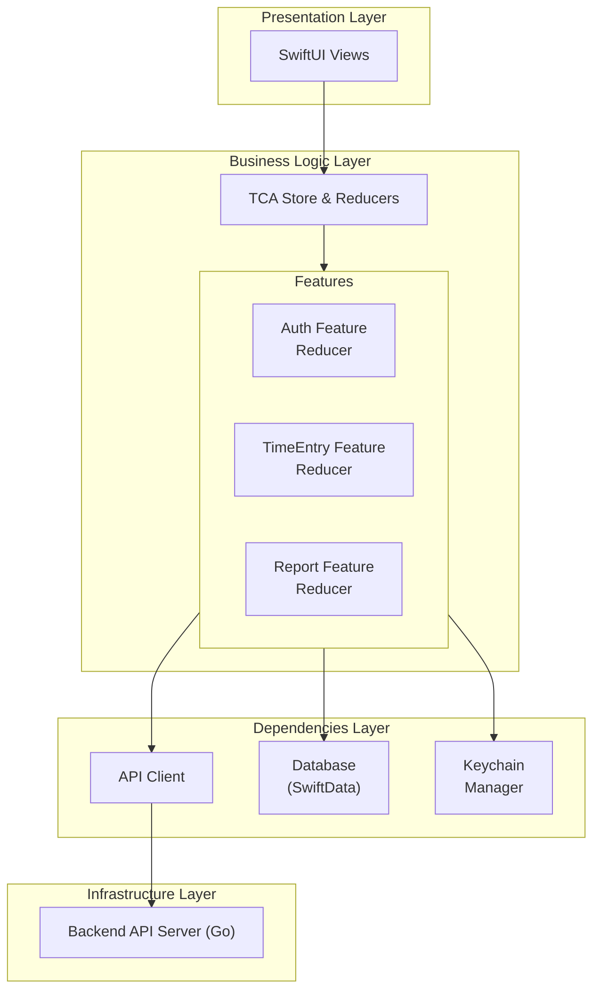
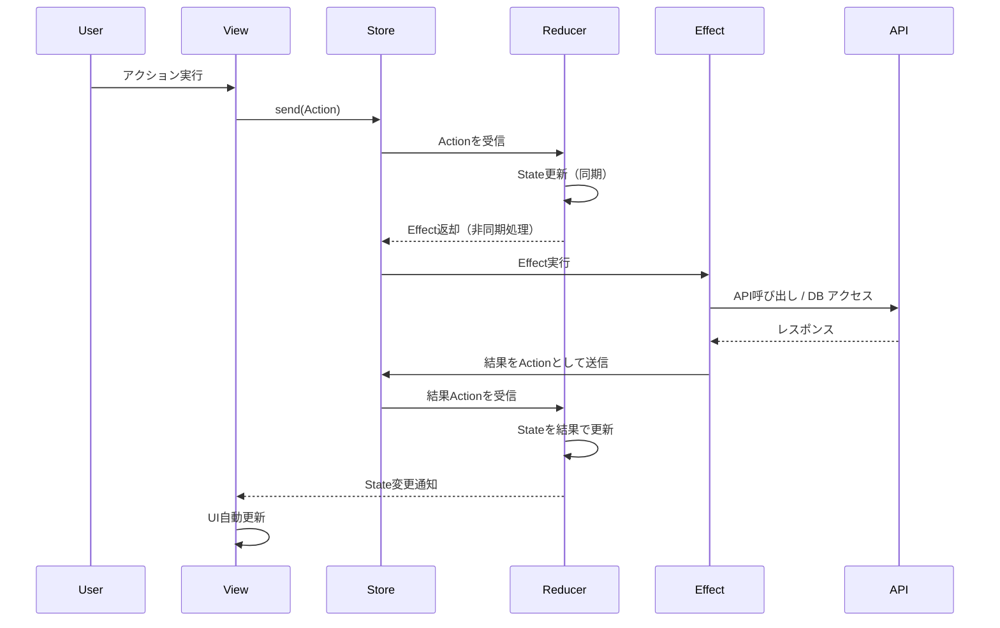
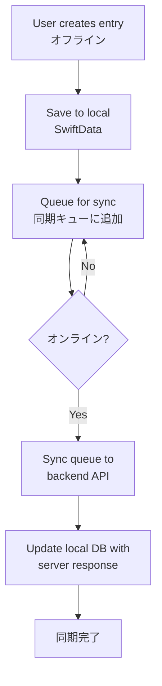

# iOS アーキテクチャ設計

## 概要

ChronoMe iOSアプリは、The Composable Architecture (TCA)をベースとしたアーキテクチャを採用します。TCAは状態管理、副作用の制御、テスタビリティを高いレベルで実現する設計パターンです。

## アーキテクチャ全体像



## レイヤー構成

### 1. Presentation Layer（SwiftUI Views）

**責務**: UIの描画とユーザーインタラクションの受け付け

```swift
// 例: タイムエントリ一覧画面
struct TimeEntryListView: View {
    let store: StoreOf<TimeEntryListFeature>

    var body: some View {
        WithViewStore(store, observe: { $0 }) { viewStore in
            List {
                ForEach(viewStore.entries) { entry in
                    TimeEntryRow(entry: entry)
                }
            }
            .onAppear {
                viewStore.send(.onAppear)
            }
        }
    }
}
```

**特徴**:
- ビジネスロジックを含まない
- Storeから状態を購読し、アクションを送信するのみ
- テストは主にスナップショットテストやプレビューで確認

### 2. Business Logic Layer（TCA Reducers）

**責務**: 状態管理、ビジネスロジック、副作用の調整

#### Reducer構造

```swift
@Reducer
struct TimeEntryListFeature {
    // 状態
    struct State: Equatable {
        var entries: [TimeEntry] = []
        var isLoading = false
        var errorMessage: String?
    }

    // アクション
    enum Action: Equatable {
        case onAppear
        case entriesResponse(TaskResult<[TimeEntry]>)
        case deleteEntry(id: UUID)
    }

    // 依存性
    @Dependency(\.apiClient) var apiClient
    @Dependency(\.database) var database

    // ビジネスロジック
    var body: some ReducerOf<Self> {
        Reduce { state, action in
            switch action {
            case .onAppear:
                state.isLoading = true
                return .run { send in
                    await send(.entriesResponse(
                        TaskResult { try await apiClient.fetchEntries() }
                    ))
                }

            case let .entriesResponse(.success(entries)):
                state.isLoading = false
                state.entries = entries
                return .none

            case let .entriesResponse(.failure(error)):
                state.isLoading = false
                state.errorMessage = error.localizedDescription
                return .none

            case let .deleteEntry(id):
                return .run { send in
                    try await apiClient.deleteEntry(id: id)
                }
            }
        }
    }
}
```

#### Feature分割

アプリは以下のFeatureに分割します：

- **AppFeature**: アプリ全体の状態管理（ルーティング、認証状態）
- **AuthFeature**: 認証（ログイン、サインアップ、ログアウト）
- **TimeEntryFeature**: タイムエントリのCRUD操作
- **ProjectFeature**: プロジェクト管理
- **TagFeature**: タグ管理
- **ReportFeature**: レポート表示と集計
- **SettingsFeature**: 設定画面

#### Feature合成

```swift
@Reducer
struct AppFeature {
    struct State: Equatable {
        var auth: AuthFeature.State?
        var timeEntry: TimeEntryFeature.State?
        // ...
    }

    enum Action {
        case auth(AuthFeature.Action)
        case timeEntry(TimeEntryFeature.Action)
        // ...
    }

    var body: some ReducerOf<Self> {
        Reduce { state, action in
            // ルーティング等の上位アクションをここで扱う
            return .none
        }
        .ifLet(\.auth, action: /Action.auth) { AuthFeature() }
        .ifLet(\.timeEntry, action: /Action.timeEntry) { TimeEntryFeature() }
        // ...
    }
}
```

### 3. Dependencies Layer

**責務**: 外部リソースへのアクセスを抽象化

#### API Client

```swift
struct APIClient {
    var fetchEntries: @Sendable () async throws -> [TimeEntry]
    var createEntry: @Sendable (TimeEntryRequest) async throws -> TimeEntry
    var updateEntry: @Sendable (UUID, TimeEntryRequest) async throws -> TimeEntry
    var deleteEntry: @Sendable (UUID) async throws -> Void
    // ...
}

extension APIClient: DependencyKey {
    static let liveValue = Self(
        fetchEntries: {
            // URLSessionを使った実装
        },
        // ...
    )

    static let testValue = Self(
        fetchEntries: { [] },
        // ...
    )
}
```

#### Database Client（SwiftData）

```swift
struct DatabaseClient {
    var saveEntry: @Sendable (TimeEntry) async throws -> Void
    var fetchCachedEntries: @Sendable () async throws -> [TimeEntry]
    var clearCache: @Sendable () async throws -> Void
}
```

#### Keychain Client

```swift
struct KeychainClient {
    var saveToken: @Sendable (String) async throws -> Void
    var loadToken: @Sendable () async throws -> String?
    var deleteToken: @Sendable () async throws -> Void
}
```

### 4. Infrastructure Layer

**責務**: 実際のネットワーク通信、データベース操作、認証処理

- **Backend API**: Go製APIサーバー（既存）
- **SwiftData**: ローカルDB（オフライン対応、キャッシュ）
- **Keychain**: 認証トークンの安全な保存

## データフロー

### 1. 通常のデータフロー（API → UI）



### 2. オフライン対応フロー



## モジュール構成

### ディレクトリ構造

```
ChronoMe/
├── App/
│   ├── ChronoMeApp.swift          # Entry point
│   └── AppFeature.swift           # Root feature
├── Features/
│   ├── Auth/
│   │   ├── AuthFeature.swift
│   │   ├── LoginView.swift
│   │   └── SignupView.swift
│   ├── TimeEntry/
│   │   ├── TimeEntryFeature.swift
│   │   ├── TimeEntryListView.swift
│   │   └── TimeEntryFormView.swift
│   ├── Project/
│   ├── Tag/
│   ├── Report/
│   └── Settings/
├── Dependencies/
│   ├── APIClient.swift
│   ├── DatabaseClient.swift
│   ├── KeychainClient.swift
│   └── DateProvider.swift
├── Models/
│   ├── TimeEntry.swift
│   ├── Project.swift
│   ├── Tag.swift
│   └── User.swift
├── Infrastructure/
│   ├── API/
│   │   ├── URLSessionAPIClient.swift
│   │   └── APIEndpoints.swift
│   ├── Database/
│   │   └── SwiftDataClient.swift
│   └── Keychain/
│       └── KeychainManager.swift
├── Utilities/
│   ├── Extensions/
│   └── Helpers/
└── Resources/
    ├── Assets.xcassets
    └── Localizable.strings
```

## 状態管理戦略

### グローバル状態 vs ローカル状態

| 状態の種類 | 管理場所 | 例 |
|-----------|---------|---|
| グローバル | AppFeature.State | 認証状態、ユーザー情報 |
| Feature固有 | 各Feature.State | タイムエントリ一覧、フィルター状態 |
| 一時的なUI状態 | SwiftUI @State | モーダル表示状態、アニメーション |

### 永続化戦略

| データ種類 | 保存先 | 同期 |
|-----------|-------|------|
| 認証トークン | Keychain | - |
| タイムエントリ | SwiftData + API | 双方向 |
| プロジェクト | SwiftData + API | 双方向 |
| ユーザー設定 | UserDefaults | - |

## エラーハンドリング

### エラーの種類

```swift
enum AppError: Error, Equatable {
    case network(NetworkError)
    case database(DatabaseError)
    case authentication(AuthError)
    case validation(ValidationError)
}

enum NetworkError: Error {
    case noConnection
    case timeout
    case serverError(statusCode: Int)
    case decodingFailed
}
```

### エラー表示戦略

- **致命的エラー**: アラートで表示
- **一時的エラー**: トーストやバナーで表示
- **バリデーションエラー**: フォーム内にインライン表示

## テスト戦略

### ユニットテスト（Reducer）

```swift
@MainActor
final class TimeEntryFeatureTests: XCTestCase {
    func testFetchEntries() async {
        let store = TestStore(initialState: TimeEntryListFeature.State()) {
            TimeEntryListFeature()
        } withDependencies: {
            $0.apiClient.fetchEntries = { [mockEntry1, mockEntry2] }
        }

        await store.send(.onAppear) {
            $0.isLoading = true
        }

        await store.receive(.entriesResponse(.success([mockEntry1, mockEntry2]))) {
            $0.isLoading = false
            $0.entries = [mockEntry1, mockEntry2]
        }
    }
}
```

### 統合テスト

- Feature間の連携テスト
- API ClientとDatabase Clientのモックを使用

### UIテスト

- 主要なユーザーフローをE2Eテスト
- XCUITestを使用

## パフォーマンス最適化

### リスト表示の最適化

- LazyVStackによる遅延読み込み
- データのページネーション
- キャッシュ戦略（SwiftData）

### 状態更新の最適化

- Equatable準拠によるムダな再レンダリング防止
- ViewStoreの観測範囲を最小化

## セキュリティ

- **認証トークン**: Keychainに暗号化保存
- **通信**: HTTPS通信のみ（App Transport Security）
- **生体認証**: LocalAuthenticationによるFace ID/Touch ID
- **証明書ピンニング**: 必要に応じて実装検討

## まとめ

TCAベースのアーキテクチャにより、以下を実現します：

- **明確な状態管理**: 単一のStateツリー
- **テスタビリティ**: Reducerロジックを完全にテスト可能
- **保守性**: Feature分割による関心の分離
- **拡張性**: 新しいFeatureの追加が容易
- **型安全性**: Swiftの型システムを活用したコンパイル時エラー検出
