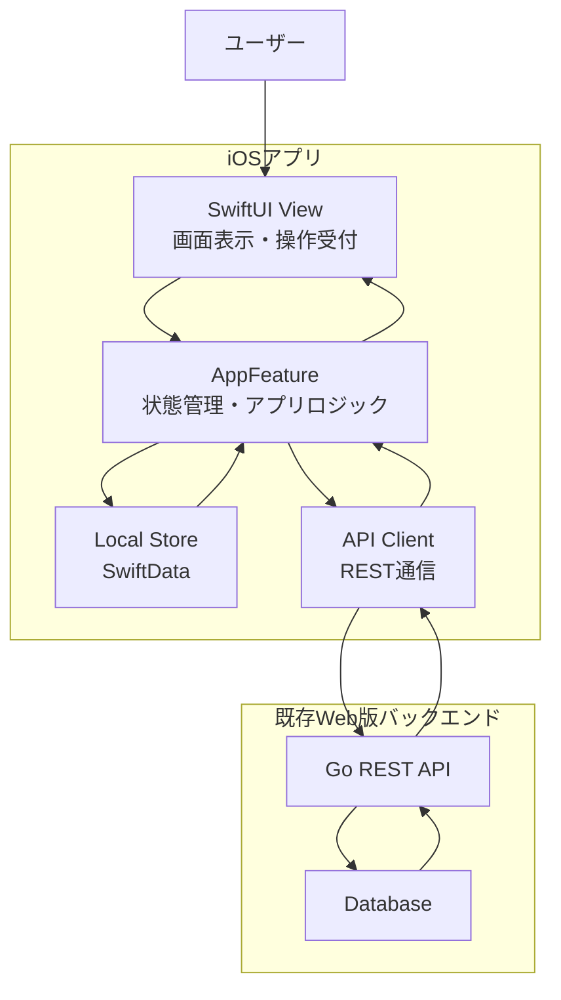
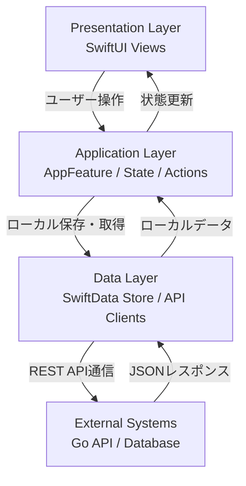
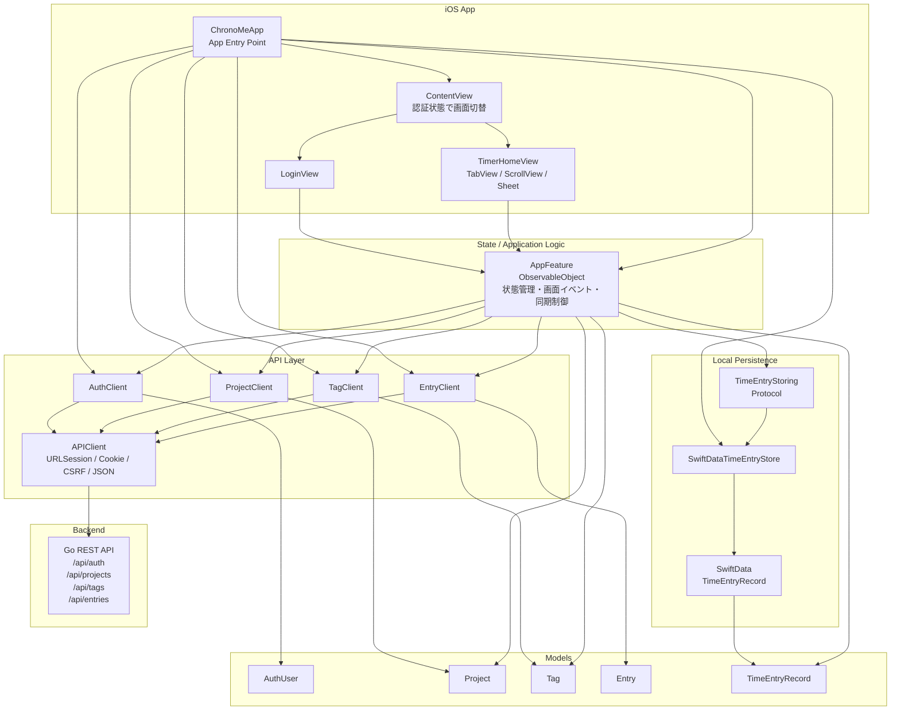
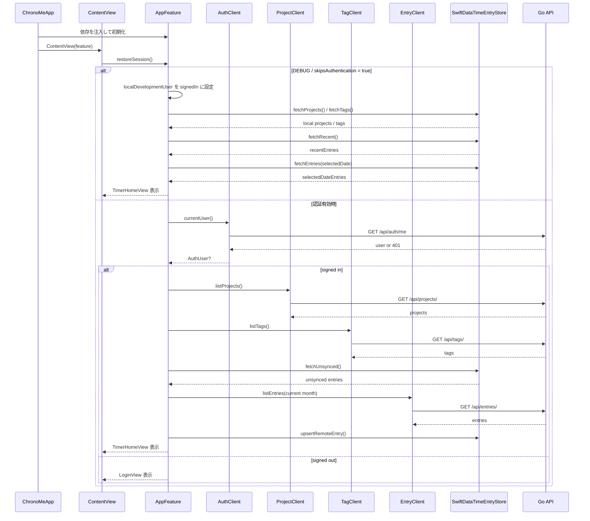
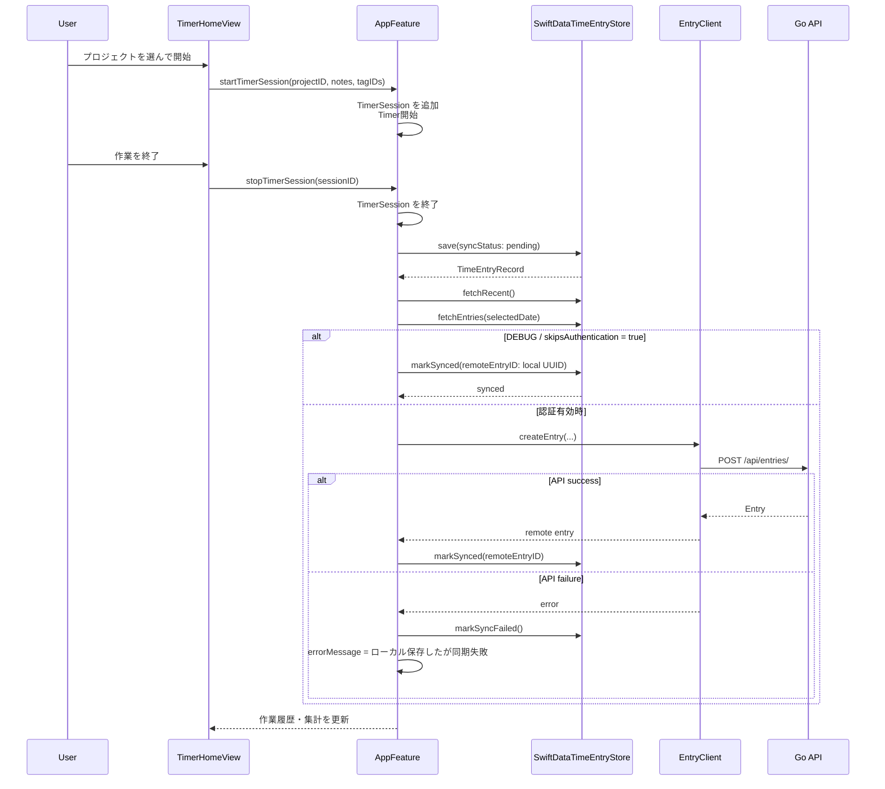
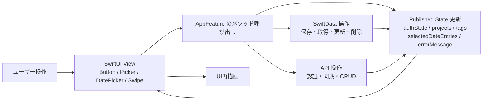

# 現在の iOS アーキテクチャとデータフロー

このドキュメントは、現在の iOS 実装に基づくアーキテクチャ構成とデータフローを示す。

設計資料では The Composable Architecture (TCA) の採用を計画しているが、現時点の実装は
SwiftUI + `AppFeature` (`ObservableObject`) + Client/Store 抽象 + SwiftData + 既存 Go API
という構成である。

## アーキテクチャ構成

発表などで全体像を説明する場合は、現在の iOS 版を以下のように抽象化できる。

レイヤー構成として整理すると、以下のようになる。

詳細な実装構成は以下の通り。

## 起動時・認証時のデータフロー

## タイマー記録・同期のデータフロー

## 画面イベントから状態更新まで

## 要約

現在の iOS 版では、View は `AppFeature` の状態を表示し、ユーザー操作を `AppFeature`
のメソッド呼び出しとして渡す。`AppFeature` はローカル保存と API 通信をまとめて制御し、
SwiftData を先に更新してから、必要に応じてバックエンド API と同期する。

この構成により、ローカルでの素早い記録、同期失敗時の保持、後続の再同期が可能になっている。
