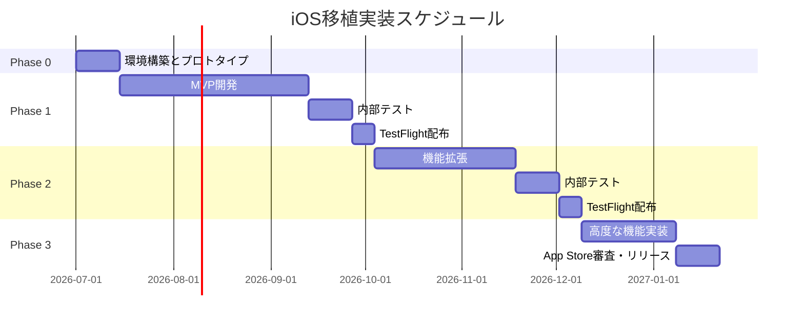
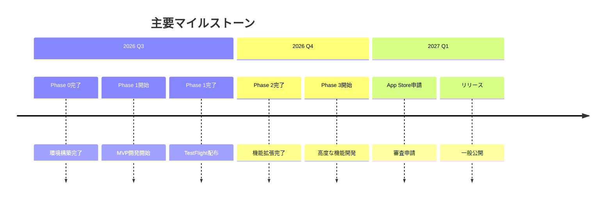

# 段階的実装計画

## 概要

ChronoMe iOSアプリの開発を段階的に進めるための実装計画です。各フェーズでMVP（Minimum Viable Product）を定義し、段階的にリリースとフィードバックを行います。

## フェーズ構成

## Phase 0: 環境構築とプロトタイプ

**期間**: 2週間
**目的**: 開発環境の整備と技術検証

### タスク

#### 1. プロジェクト初期化

- [ ] Xcodeプロジェクト作成（iOS 17.0以上）
- [ ] Swift Package Managerのセットアップ
- [ ] TCA依存関係の追加
- [ ] .gitignore設定
- [ ] ディレクトリ構造の作成

#### 2. CI/CD環境構築

- [ ] GitHub Actionsワークフロー設定
- [ ] ビルド自動化
- [ ] ユニットテスト自動実行
- [ ] SwiftLint / SwiftFormat設定

#### 3. 技術検証（PoC）

- [ ] TCAの基本的な実装パターン確認
- [ ] SwiftDataのCRUD操作確認
- [ ] URLSessionでのAPI通信テスト
- [ ] Keychainへのトークン保存テスト
- [ ] バックグラウンドタイマー動作確認

#### 4. デザインシステム構築

- [ ] カラーパレット定義（Asset Catalog）
- [ ] タイポグラフィ設定
- [ ] 共通コンポーネント（ボタン、カード、リストアイテム）
- [ ] ダークモード対応

### 成果物

- 動作するXcodeプロジェクト
- CI/CDパイプライン
- 基本的なデザインシステム
- 技術検証レポート

---

## Phase 1: MVP（Minimum Viable Product）

**期間**: 8-10週間
**目的**: コア機能を実装し、TestFlightでのβテストを開始

### 実装機能

#### 認証機能

- [ ] ログイン画面（AuthFeature）
  - メールアドレス/パスワード入力
  - バリデーション
  - エラーハンドリング
- [ ] サインアップ画面
- [ ] ログアウト機能
- [ ] Keychainへの認証トークン保存
- [ ] 自動ログイン

#### タイムエントリ機能

- [ ] タイムエントリ一覧画面（TimeEntryFeature）
  - エントリリスト表示
  - 日付フィルター
  - スワイプで削除
  - プルトゥリフレッシュ
- [ ] タイムエントリ作成画面
  - 開始時刻/終了時刻選択
  - プロジェクト選択
  - タグ選択
  - メモ入力
- [ ] タイムエントリ編集画面
- [ ] タイマー機能
  - 作業開始/終了ボタン
  - バックグラウンド動作
  - タイマー実行中のインジケーター

#### プロジェクト管理

- [ ] プロジェクト一覧画面（ProjectFeature）
- [ ] プロジェクト作成/編集
- [ ] プロジェクトカラー選択

#### タグ管理

- [ ] タグ一覧画面（TagFeature）
- [ ] タグ作成/編集
- [ ] タグカラー選択

#### レポート機能（基本）

- [ ] 日次サマリー表示（ReportFeature）
  - 合計作業時間
  - プロジェクト別内訳
- [ ] 週次サマリー表示
- [ ] 棒グラフ表示（Swift Charts）

#### データ管理

- [ ] SwiftDataモデル定義
  - TimeEntry
  - Project
  - Tag
  - User
- [ ] オフライン対応
  - ローカルDB保存
  - 同期キュー実装
  - オンライン時の自動同期

#### API統合

- [ ] APIClient実装（URLSession）
  - GET /api/entries
  - POST /api/entries
  - PUT /api/entries/:id
  - DELETE /api/entries/:id
  - GET /api/projects
  - POST /api/projects
  - GET /api/tags
  - POST /api/tags
- [ ] エラーハンドリング
- [ ] リトライロジック

#### ウィジェット（基本）

- [ ] 小サイズウィジェット（今日の合計時間）
- [ ] 中サイズウィジェット（今日の詳細）

#### 通知

- [ ] 作業開始リマインダー
- [ ] 作業終了リマインダー

#### 設定画面

- [ ] ユーザープロフィール表示
- [ ] 通知設定
- [ ] ログアウトボタン

### テスト

- [ ] 全Featureのユニットテスト（80%以上のカバレッジ）
- [ ] 重要フローのUIテスト
  - ログイン→タイムエントリ作成→ログアウト
  - タイマー開始→終了
  - オフライン→オンライン同期

### 成果物

- TestFlight配布可能なビルド
- Phase 1テスト計画書
- 既知の問題リスト

---

## Phase 2: 機能拡張とUX改善

**期間**: 6-7週間
**目的**: Phase 1のフィードバックを反映し、機能を拡張

### 実装機能

#### レポート機能（拡張）

- [ ] 月次サマリー表示
- [ ] カスタム期間指定
- [ ] 比較機能（前週/前月比較）
- [ ] 円グラフ表示
- [ ] 折れ線グラフ表示
- [ ] データエクスポート
  - CSV形式
  - JSON形式
  - Share Sheet経由

#### ウィジェット（拡張）

- [ ] 大サイズウィジェット（週間サマリー）
- [ ] ロック画面ウィジェット
  - インライン表示（合計時間）
  - サーキュラー表示（進捗率）

#### 通知（拡張）

- [ ] 休憩リマインダー
- [ ] 週次レポート通知
- [ ] カスタム通知スケジュール

#### ショートカット連携

- [ ] App Intents実装
  - タイムエントリ開始
  - タイムエントリ終了
  - 今日のサマリー取得
- [ ] Siriショートカット対応
- [ ] ショートカットアプリでの提案

#### 検索機能

- [ ] エントリ検索（プロジェクト名、タグ、メモ）
- [ ] 検索履歴
- [ ] フィルター複合条件

#### UX改善

- [ ] ハプティックフィードバック追加
- [ ] アニメーション改善
- [ ] エラーメッセージの改善
- [ ] オンボーディング画面
- [ ] 空状態のUI改善

#### iPad最適化

- [ ] マルチカラムレイアウト
- [ ] スプリットビュー対応
- [ ] キーボードショートカット
- [ ] ドラッグ&ドロップ対応

#### セキュリティ強化

- [ ] 証明書ピンニング実装
- [ ] 生体認証（Face ID / Touch ID）
  - ログイン時
  - 設定画面での有効化

### パフォーマンス最適化

- [ ] リストのページネーション実装
- [ ] 画像キャッシュ（必要な場合）
- [ ] データベースクエリ最適化
- [ ] メモリ使用量の最適化

### テスト

- [ ] 新機能のユニットテスト
- [ ] パフォーマンステスト
- [ ] アクセシビリティテスト（VoiceOver）

### 成果物

- Phase 2機能を含むTestFlightビルド
- パフォーマンステストレポート
- アクセシビリティ監査レポート

---

## Phase 3: 高度な機能とリリース準備

**期間**: 4-5週間
**目的**: 高度な機能の実装とApp Storeリリース

### 実装機能

#### Apple Watch対応（オプション）

- [ ] Watch用Appターゲット作成
- [ ] タイマー開始/終了
- [ ] 今日のサマリー表示
- [ ] コンプリケーション

#### ダイナミックアイランド対応（iPhone 14 Pro以降）

- [ ] Live Activity実装
  - タイマー実行中の表示
  - 経過時間のリアルタイム更新

#### Handoff対応

- [ ] Web版とiOS版の連携
- [ ] 作業中のエントリをデバイス間で引き継ぎ

#### インタラクティブウィジェット（iOS 17+）

- [ ] ウィジェットからタイマー開始
- [ ] ウィジェットからタイマー終了

#### PDFレポート

- [ ] PDFレポート生成
- [ ] カスタマイズ可能なレポートテンプレート
- [ ] Share Sheet経由でエクスポート

#### アプリ内フィードバック

- [ ] フィードバック送信機能
- [ ] バグレポート機能（ログ添付）

### リリース準備

#### App Store最適化

- [ ] アプリアイコン最終版
- [ ] スクリーンショット作成（全サイズ）
- [ ] アプリプレビュー動画作成
- [ ] App Store説明文作成（日本語/英語）
- [ ] キーワード選定

#### コンプライアンス

- [ ] プライバシーポリシー作成
- [ ] 利用規約作成
- [ ] App Privacy Nutrition Labels作成

#### ドキュメント

- [ ] ユーザーガイド作成
- [ ] FAQ作成
- [ ] リリースノート作成

#### 最終テスト

- [ ] フル機能のE2Eテスト
- [ ] 全デバイスでの動作確認
- [ ] 多言語対応確認
- [ ] アクセシビリティ最終確認

### App Store申請

- [ ] App Store Connectでアプリ登録
- [ ] ビルドアップロード
- [ ] 審査申請
- [ ] 審査対応
- [ ] リリース

### 成果物

- App Store公開アプリ
- リリースノート
- サポートドキュメント

---

## リスク管理

### 技術リスク

| リスク | 影響 | 対策 |
|-------|------|------|
| SwiftDataの不具合 | 高 | Core Dataへのフォールバック準備 |
| API互換性問題 | 高 | API仕様の事前確認、モックサーバー利用 |
| バックグラウンド処理制限 | 中 | iOS制限の事前調査、代替案検討 |
| TCAの学習曲線 | 中 | Phase 0での十分な検証、チュートリアル活用 |

### スケジュールリスク

| リスク | 影響 | 対策 |
|-------|------|------|
| 想定外のバグ | 中 | バッファ期間の確保（各フェーズ+1週間） |
| Apple審査の遅延 | 低 | 余裕を持った申請スケジュール |
| 要件変更 | 中 | Phase区切りでの確認、柔軟な対応 |

---

## 品質基準

### コードカバレッジ

- ユニットテスト: 80%以上
- Reducerロジック: 100%
- UI層: スナップショットテストでカバー

### パフォーマンス

- 初期起動: 1秒以内
- リスト表示: 0.5秒以内
- API応答: 2秒以内（タイムアウト）

### アクセシビリティ

- VoiceOver対応: 全画面
- ダイナミックタイプ: 対応
- カラーコントラスト: WCAG AA準拠

---

## マイルストーン

---

## 成功基準

### Phase 1（MVP）

- [ ] 全コア機能が動作する
- [ ] TestFlightで5名以上にβテスト配布
- [ ] クリティカルバグが0件
- [ ] ユーザーフィードバック収集

### Phase 2（機能拡張）

- [ ] 全拡張機能が動作する
- [ ] TestFlightで10名以上にβテスト配布
- [ ] パフォーマンス目標達成
- [ ] アクセシビリティ基準達成

### Phase 3（リリース）

- [ ] App Store審査通過
- [ ] 一般公開
- [ ] 初週ダウンロード数50件以上
- [ ] クラッシュ率1%未満

---

## まとめ

この段階的実装計画により、リスクを最小化しながら、高品質なiOSアプリを開発します。各フェーズでのフィードバックループを通じて、ユーザーニーズに合ったアプリを提供します。
